<!-- generated-by: gsd-doc-writer -->
# Architecture

## System Overview

LLM Conclave is a multi-agent deliberation server for TypeScript/Node. It accepts a question or task, fans it out to a configurable panel of LLM agents drawn from five providers (Anthropic Claude, OpenAI GPT, Google Gemini, xAI Grok, Mistral), orchestrates multi-round discussion or structured consultation between those agents, and returns a synthesized result with confidence rating, dissent surfacing, cost accounting, and an optional compliance-grade Deliberation Record. It exposes its capabilities via two transport surfaces: an MCP protocol server (stdio or SSE) and a lightweight REST API.

---

## Component Diagram

```mermaid
graph TD
    Client["MCP Client / REST caller"]

    subgraph Transport["mcp/ — Transport Layer"]
        MCPServer["MCP Server\n(stdio | SSE)"]
        REST["REST API\n(POST /api/discuss\nPOST /api/export_record)"]
        DiscussionRunner["DiscussionRunner\n(shared execution core)"]
    end

    subgraph Orchestration["orchestration/ — Orchestration"]
        ConsultOrch["ConsultOrchestrator\n(4-round consult)"]
        IterCollab["IterativeCollaborativeOrchestrator\n(discuss mode)"]
        StateMachine["ConsultStateMachine"]
        TaskClassifier["TaskClassifier"]
    end

    subgraph Core["core/ — Conversation Engine"]
        ConvMgr["ConversationManager\n(round loop, judge logic)"]
        ConvHist["ConversationHistory\n(history, compression)"]
        AgentExec["AgentTurnExecutor\n(retry, fallback, circuit breaker)"]
        JudgeEval["JudgeEvaluator\n(consensus, confidence)"]
        ConfRecon["ConfidenceReconciler"]
        RoundMembership["roundMembership\n(SSOT contributor predicate)"]
        SessionMgr["SessionManager\n(persist, resume)"]
        CostTracker["CostTracker"]
        EventBus["EventBus"]
    end

    subgraph Config["config/ — Configuration"]
        ConfigCascade["ConfigCascade\n(5-level priority merge)"]
        PersonaSystem["PersonaSystem\n(persona resolution)"]
    end

    subgraph Providers["providers/ — LLM Providers"]
        LLMBase["LLMProvider (abstract)\n(retry, cost logging)"]
        Claude["ClaudeProvider"]
        OpenAI["OpenAIProvider"]
        Gemini["GeminiProvider"]
        Grok["GrokProvider"]
        Mistral["MistralProvider"]
        ProviderFactory["ProviderFactory\n(model-name routing)"]
        Preflight["PreflightChecker"]
        GeminiCache["GeminiCacheManager"]
    end

    subgraph Consult["consult/ — Consult Subsystem"]
        Artifacts["artifacts/\n(extraction, schemas)"]
        Analytics["analytics/\n(SQLite indexer)"]
        Formatting["formatting/\n(Markdown, JSON-LD, PDF)"]
        DelibRecord["exportDeliberationRecordCore\n(shared export handler)"]
        Health["health/\n(hedging, tiers, monitor)"]
        Context["context/\n(loader, brownfield, stack)"]
        Cost["cost/\n(estimator, gate)"]
    end

    Client --> MCPServer
    Client --> REST
    MCPServer --> DiscussionRunner
    MCPServer --> ConsultOrch
    REST --> DiscussionRunner
    DiscussionRunner --> ConvMgr
    ConsultOrch --> StateMachine
    ConsultOrch --> Artifacts
    ConvMgr --> AgentExec
    ConvMgr --> JudgeEval
    ConvMgr --> ConvHist
    ConvMgr --> ConfRecon
    ConvMgr --> RoundMembership
    AgentExec --> ProviderFactory
    JudgeEval --> ProviderFactory
    ProviderFactory --> Claude & OpenAI & Gemini & Grok & Mistral
    Claude & OpenAI & Gemini & Grok & Mistral --> LLMBase
    LLMBase --> CostTracker
    DiscussionRunner --> SessionMgr
    DiscussionRunner --> ConfigCascade
    DiscussionRunner --> PersonaSystem
    DiscussionRunner --> Preflight
    MCPServer --> DelibRecord
    REST --> DelibRecord
    DelibRecord --> Formatting
    ConsultOrch --> Analytics
    MCPServer --> Analytics
    Gemini --> GeminiCache
    ConvMgr --> EventBus
```



---

## Data Flow

### Discuss mode (primary path)

1. A client invokes `llm_conclave_discuss` over MCP (stdio or SSE) or `POST /api/discuss` over HTTP.
2. `server.ts` (MCP) or the REST handler delegates to **`DiscussionRunner.run()`** — the single execution core shared by `handleDiscuss`, `handleContinue`, and the REST endpoint.
3. `DiscussionRunner` resolves config via **`ConfigCascade`** (5-level merge: CLI flags → env vars → project `.llm-conclave.json` → global `~/.llm-conclave/config.json` → built-in defaults), resolves personas via **`PersonaSystem`**, and runs **`PreflightChecker`** to validate credentials and model names before spending any tokens.
4. `DiscussionRunner` instantiates **`ConversationManager`** and calls `runDiscussion()`.
5. `ConversationManager` executes rounds. Each round: **`SpeakerSelector`** picks the next agent (round-robin or dynamic LLM moderation), **`AgentTurnExecutor`** calls that agent's provider via **`LLMProvider.chat()`** with exponential-backoff retry and silent model substitution (or hard failure if `strict_models: true`), and pushes the result into **`ConversationHistory`** with a canonical `roundNumber` stamp.
6. After each round, **`JudgeEvaluator`** evaluates consensus. The judge receives deterministic **`MachinerySignals`** (participation, turn balance, abort state) that cap its confidence rating regardless of its self-assessment.
7. **`ConfidenceReconciler`** merges judge self-report with machinery signals into a single `finalConfidence` value (LOW / MEDIUM / HIGH) — the single source of truth for all output formatters.
8. On completion, **`SessionManager`** persists the `SessionManifest` to `getConclaveHome()/sessions/`. **`AnalyticsIndexer`** writes a row to `consult-analytics.db` (SQLite).
9. The result is formatted (markdown / JSON / both) and returned to the caller.

### Consult mode

1. `llm_conclave_consult` invokes **`ConsultOrchestrator`**, which drives a deterministic 4-round state machine via **`ConsultStateMachine`**: `Idle → Estimating → AwaitingConsent → Independent → Synthesis → CrossExam → Verdict → Complete`.
2. Round 1 fans agent calls out in parallel. Rounds 2–4 are sequential synthesis, cross-examination, and verdict phases.
3. **`ArtifactExtractor`** parses structured artifacts (schemas in `consult/artifacts/schemas/`) from each round's output.
4. The final result is formatted via **`FormatterFactory`** and optionally logged to `ConsultationFileLogger`.

### Deliberation Record export

1. `llm_conclave_export_record` (MCP) or `POST /api/export_record` (REST) calls **`exportDeliberationRecordCore`** — the single shared handler for both transports.
2. The core validates the `session_id` format (allowlist regex, path-traversal rejection), applies per-field byte caps, and loads the session via `SessionManager`.
3. **`DeliberationRecordBuilder`** normalizes the session into a `DeliberationRecordSource`.
4. **`FormatterFactory.renderDeliberationRecord()`** dispatches to `DeliberationRecordFormatter` (markdown) or `DeliberationRecordPdfFormatter` (PDF Buffer, base64-encoded for transport). No LLM calls are made.

---

## Key Abstractions

| Abstraction | Location | Purpose |
|---|---|---|
| `LLMProvider` (abstract) | `src/providers/LLMProvider.ts` | Base class for all providers. Owns retry loop (3 attempts, exponential backoff), cost-call logging, and the `healthCheck()` contract. Concrete providers implement `performChat()`. |
| `LLMProviderInterface` | `src/types/index.ts` | Structural interface (`modelName`, `chat()`, `getProviderName()`, `getModelName()`, `healthCheck()`) used to break circular dependencies. |
| `ProviderFactory` | `src/providers/ProviderFactory.ts` | Routes model-name strings to provider instances. Handles shorthand aliases (e.g. `"sonnet"` → `claude-sonnet-4-5`). |
| `ConversationManager` | `src/core/ConversationManager.ts` | Central round-loop coordinator for discuss mode. Delegates history to `ConversationHistory`, agent execution to `AgentTurnExecutor`, and judge evaluation to `JudgeEvaluator`. |
| `ConsultStateMachine` | `src/orchestration/ConsultStateMachine.ts` | Enforces valid state transitions for the 4-round consult flow. Terminal states: `Complete` and `Aborted`. |
| `ConfigCascade` | `src/config/ConfigCascade.ts` | 5-level priority merge (CLI flags > env vars > project config > global config > built-in defaults). Resolves the effective config for each run. |
| `PersonaSystem` | `src/config/PersonaSystem.ts` | Resolves built-in persona names (e.g. `security`, `architect`) and custom personas from `~/.llm-conclave/config.json` into agent configurations. Supports `@set` expansion. |
| `isAgentContribution` / `roundOf` | `src/core/roundMembership.ts` | Single source of truth for contributor identification and round membership. All counting of who spoke in which round routes through these helpers — never re-inlined. |
| `ConfidenceReconciler` | `src/core/ConfidenceReconciler.ts` | Merges judge self-report with deterministic machinery signals into a single `FinalConfidence` value. All output formatters read this; independent recalculation is forbidden. |
| `exportDeliberationRecordCore` | `src/consult/formatting/exportDeliberationRecordCore.ts` | Shared transport-independent handler for Deliberation Record export. Both MCP and REST routes delegate here. Validates inputs, loads session, builds and formats the record. |
| `FormatterFactory` | `src/consult/formatting/FormatterFactory.ts` | Central dispatch for all output formatting: Markdown, JSON-LD, and async PDF (via `DeliberationRecordPdfFormatter`). PDF is async/Buffer and cannot use the sync `IOutputFormatter` interface. |
| `SessionManager` | `src/core/SessionManager.ts` | Persists, loads, and lists `SessionManifest` objects under `getConclaveHome()/sessions/`. Computes `completed` vs `completed_degraded` status from run signals. |
| `getConclaveHome()` | `src/utils/ConfigPaths.ts` | Resolves the effective data root: `LLM_CONCLAVE_HOME` env var → `conclaveHome` key in global config → test tmpdir fallback → `~/.llm-conclave` default. |
| `DiscussionRunner` | `src/mcp/DiscussionRunner.ts` | Unified execution abstraction used by `handleDiscuss`, `handleContinue`, and the REST `/api/discuss` handler. Eliminates three-way code duplication. |

---

## Provider Message Format

The internal canonical message format follows the **Anthropic schema**: `tool_result` role with `tool_use_id`. Each provider implementation translates on the way out:

| Provider | Tool message format | Config nesting |
|---|---|---|
| Claude (Anthropic) | `role: 'tool_result'` + `tool_use_id` | Top-level |
| OpenAI / Grok | `role: 'tool'` + `tool_call_id` | Top-level |
| Gemini | `role: 'function'` + `functionResponse` | All config (system, tools, cache) under `params['config']` key |
| Mistral | `role: 'tool'` + `tool_call_id` | Top-level |

Gemini requires all function responses to be grouped in a single `Content` block using the actual function name, not the `tool_use_id`.

The default judge model is **`gemini-2.5-flash`** (1M token context window, lowest input cost, no TPM issues for synthesis). The judge receives deterministic `MachinerySignals` that constrain its confidence self-report; HIGH confidence cannot be returned on a degraded run.

---

## Directory Structure Rationale

```
src/
  config/          # ConfigCascade (5-level merge) and PersonaSystem (persona resolution)
  constants.ts     # Shared constants (e.g. DEFAULT_SELECTOR_MODEL)
  consult/         # Consult-mode subsystems — all sub-folders below serve ConsultOrchestrator
    analysis/      # DebateValueAnalyzer — rates the epistemic value of debate rounds
    analytics/     # SQLite indexer (AnalyticsIndexer) + stats queries; records every run
    artifacts/     # Structured output extraction (schemas: Independent, Synthesis, CrossExam, Verdict)
    coinage/       # detectJudgeCoinage — flags synthesis phrases absent from agent turns (AUDIT-06)
    context/       # Context loading (ContextLoader), brownfield detection, tech stack analysis
    cost/          # CostEstimator (pre-run estimate) + CostGate (user consent prompt)
    formatting/    # All output formatters: Markdown, JSON-LD, Deliberation Record (MD + PDF)
    health/        # Provider health monitoring, tiered fallbacks, hedged request manager
    logging/       # ConsultationFileLogger — writes per-run structured log files
    output/        # OutputFormatter for consult-mode result rendering
    persistence/   # PartialResultManager — checkpoints partial consult results
    security/      # SensitiveDataScrubber — strips secrets from context before sending to providers
    strategies/    # ModeStrategy abstraction (ConvergeStrategy, ExploreStrategy) for consult rounds
    termination/   # EarlyTerminationManager — consensus-triggered early exit
  core/            # Discussion-mode engine: ConversationManager, AgentTurnExecutor, JudgeEvaluator,
                   #   SessionManager, ConfidenceReconciler, EventBus, CostTracker, roundMembership
  mcp/             # Transport layer: MCP server (stdio + SSE), REST routes, DiscussionRunner
  memory/          # MemoryManager + ProjectMemory — per-project long-term memory (optional)
  orchestration/   # ConsultOrchestrator, ConsultStateMachine, IterativeCollaborativeOrchestrator,
                   #   TaskClassifier, AgentRoles
  providers/       # LLMProvider base class + five concrete providers + ProviderFactory + Preflight
  tools/           # ToolRegistry and ToolPruningInstructions — agent tool-use support
  types/           # Shared TypeScript interfaces (index.ts, consult.ts, deliberationRecord.ts)
  utils/           # ConfigPaths (getConclaveHome), ProjectContext, TokenCounter, ContextOptimizer
```

The split between `core/` and `consult/` reflects mode ownership: `core/` drives the discuss/continuation flow (round-based, open-ended), while `consult/` provides the structured 4-round consultation pipeline (artifact schemas, state machine, cost gating, health monitoring). Both modes share `providers/`, `config/`, `types/`, and `utils/`.

---

## Security Boundaries

**Path sandboxing:** The `context` parameter on `llm_conclave_consult` and `llm_conclave_discuss` is sandboxed to the MCP server's working directory. Under **stdio transport only**, `CONCLAVE_ALLOWED_CONTEXT_ROOTS` (colon-separated absolute paths) extends the sandbox. Under SSE and REST this env var is silently ignored (fail-closed).

**`POST /api/export_record` auth:** This route is fail-closed — if `CONCLAVE_API_KEY` is not set, the endpoint returns 503. When set, `Authorization: Bearer <key>` is required and validated with `crypto.timingSafeEqual` to prevent timing attacks. The body is capped at 64 KB.

**`POST /api/discuss` auth:** Optional — only enforced when `CONCLAVE_API_KEY` is set. Same constant-time comparison.

**Session ID validation:** `exportDeliberationRecordCore` rejects any `session_id` containing path-traversal characters (`..`, null bytes) before touching the filesystem.

**Symlink rejection:** `loadContextFromPath` rejects symlinks via `lstat` check before reading context files.
